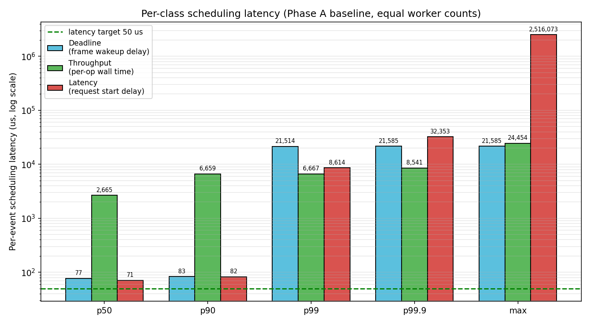
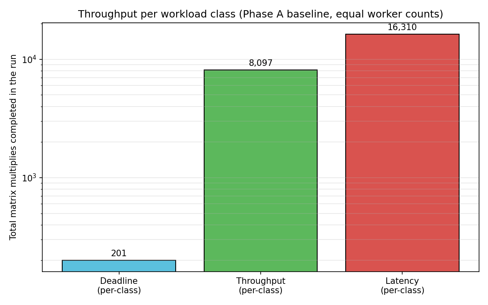
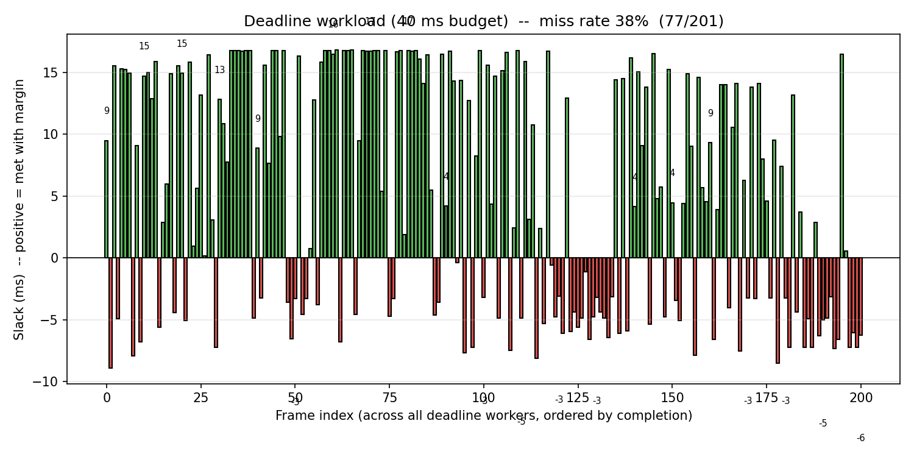

# workload_3slo -- Three-SLO Co-Location Benchmark

A benchmark that runs three workload classes simultaneously on the same set
of CPUs, each with a different Service Level Objective (SLO). Designed to
expose the limits of unmodified CFS in a co-located environment, and to
provide a clear before/after target for hint-aware scheduling extensions.

The "Phase A" baseline numbers below are produced by `--send_hints=false`,
i.e. the scheduler ignores all application intent and behaves as stock
ghOSt CFS. Phase B and Phase C will exercise the latency / throughput /
deadline hint paths in turn and re-run the same workload for comparison.

The benchmark uses **equal worker counts across all three classes** so that
no class wins by virtue of having more threads than the others. The default
is 3 threads per class (9 ghost threads total) and each class records a
comparable per-event scheduling-latency metric so the three classes can be
plotted side by side.

---

## Workload classes

Three thread classes run concurrently as ghost-scheduled threads. Each class
records a "per-event scheduling latency" so we can compare them on the same
chart, but the underlying definition is class-specific (see the per-class
section).

### Deadline workers
Real-time-style frame jobs.

```
loop until duration_sec elapses:
    target_wake = next submission slot (deadline_period_ms cadence)
    sleep_until(target_wake)
    actual_wake = now()
    record wakeup_delay = actual_wake - target_wake     <-- "latency" metric
    submit_time = actual_wake
    deadline    = submit_time + deadline_budget_ms
    matmul(deadline_dim x deadline_dim)
    complete_time = now()
    record { submit, complete, deadline, met = (complete <= deadline) }
```

KPIs: **miss rate**, **slack distribution** (positive = met with margin,
negative = missed by), **frame wakeup-delay percentiles**. Real-world
analog: a per-frame render-pipeline stage, an autonomous-driving perception
step, low-latency risk control.

### Throughput workers
Continuous CPU-bound batch.

```
loop until duration_sec elapses:
    t_start = now()
    matmul(throughput_dim x throughput_dim)
    t_end   = now()
    record per_op = t_end - t_start                     <-- "latency" metric
    ops += 1
report ops, wall-clock duration
```

Throughput workers never sleep, so they have no "wakeup delay". The
comparable signal is the **per-op wall time**: uncontested it equals the
intrinsic matmul cost; under preemption it grows by however long the worker
spent off-CPU mid-iteration. KPIs: **total ops**, **per-op wall percentiles**.
Real-world analog: batch ML inference, video transcoding, log compaction.

### Latency workers
Wakeup-driven request handlers, structured to measure scheduling delay only.

```
loop until duration_sec elapses:
    sleep_us = exponential(mean = latency_sleep_us)
    target_wake = now() + sleep_us
    sleep_until(target_wake)
    actual_wake = now()
    record start_delay = actual_wake - target_wake      <-- "latency" metric
    matmul(latency_dim x latency_dim)
```

KPIs: **start-delay percentiles** and **on-time rate** (share of requests
with `start_delay <= latency_target_us`). Real-world analog: interactive
query handler, cache lookup, user-facing RPC endpoint.

---

## The unified per-class latency metric

The three classes record three different things:

| Class | Metric in the chart | What it captures |
|-------|---------------------|------------------|
| Deadline | frame **wakeup_delay** (target_wake -> actual_wake) | how late the period boundary fired |
| Throughput | **per-op wall time** | how long one matmul actually took (preemption included) |
| Latency | request **start_delay** (target_wake -> actual_wake) | how late the request handler resumed |

All three are "extra time the scheduler stole from this work unit," in
microseconds. They are not directly comparable in absolute terms (a
throughput worker doing a 128x128 matmul has a non-zero floor at ~1 ms
even on an idle system, while a sleeping latency worker has a floor near
0), but plotting them on the same log-scale axis makes the **interference
pattern** visible: how much each class's tail latency suffers under
co-location.

---

## Flags

| Flag | Default | Meaning |
|------|---------|---------|
| `--deadline_workers` | 3 | Number of deadline threads. |
| `--deadline_dim` | 256 | Side length of the deadline matmul. |
| `--deadline_budget_ms` | 100 | Per-frame deadline. |
| `--deadline_period_ms` | 250 | Inter-frame submission period. |
| `--throughput_workers` | 3 | Number of throughput threads. |
| `--throughput_dim` | 128 | Side length of the throughput matmul. |
| `--latency_workers` | 3 | Number of latency threads. |
| `--latency_dim` | 64 | Side length of the latency matmul. |
| `--latency_sleep_us` | 1000 | Mean inter-request sleep (exponential). |
| `--latency_target_us` | 50 | Target start-latency for on-time rate. |
| `--duration_sec` | 10 | Total experiment duration. |
| `--send_hints` | false | Publish cues into `/ghost_mem_cues`. Phase A keeps this **false**. |
| `--output_file` | `/tmp/3slo_results.csv` | Per-event CSV dump. |

---

## How to run

Inside the VM:

```bash
cd /root/ghost-userspace
bazel build -c opt //:agent_cfs_mem //:workload_3slo

# Terminal 1 -- start the agent (any cfs_mem-compatible agent works).
bazel-bin/agent_cfs_mem --ghost_cpus 0-3

# Terminal 2 -- run Phase A baseline with equal counts.
bazel-bin/workload_3slo \
  --send_hints=false --duration_sec=10 \
  --deadline_workers=3 --deadline_dim=256 \
  --deadline_budget_ms=40 --deadline_period_ms=150 \
  --throughput_workers=3 --throughput_dim=128 \
  --latency_workers=3  --latency_dim=64 --latency_sleep_us=1000 \
  --latency_target_us=50 \
  --output_file=/tmp/3slo_phaseA.csv
```

The same binary is used for Phase B+ -- only `--send_hints=true` changes
once the scheduler has been extended to act on the cues.

---

## Plotting

`userspace/plot_3slo.py` consumes the per-event CSV and writes three PNGs
(`<basename>_latency.png`, `<basename>_throughput.png`,
`<basename>_deadline.png`):

```bash
python3 userspace/plot_3slo.py /tmp/3slo_phaseA.csv \
  --target-us 50 --budget-ms 40 --out-dir /tmp
```

The `_latency.png` chart is the grouped per-class scheduling-latency
plot described above; the `_throughput.png` chart is total ops per class;
the `_deadline.png` chart is the per-frame slack with miss rate annotated.

---

## Phase A baseline -- experimental setup

The baseline run that produced the numbers and charts in this README used
the following configuration on the QEMU + KVM dev VM (4 vCPUs):

| Parameter | Value |
|-----------|-------|
| ghOSt agent | `agent_cfs_mem --ghost_cpus 0-3` (cues collected but **ignored**) |
| `--send_hints` | `false` (no cue is ever written) |
| `--duration_sec` | 10 |
| Deadline workers | **3 threads**, 256x256 matmul, **40 ms budget**, 150 ms period |
| Throughput workers | **3 threads**, 128x128 matmul (continuous loop) |
| Latency workers | **3 threads**, 64x64 matmul, exponential sleep mean = 1 ms, target = 50 us start delay |
| Total threads | 3 + 3 + 3 = **9 ghost threads on 4 vCPUs** (~2.25x oversubscription) |

Why these numbers:
  - 256x256 matmul takes ~25 ms uncontested on this VM. A 40 ms budget
    leaves only ~15 ms of slack -- *just enough* to be vulnerable.
    Easier budgets (>= 100 ms) make the deadline class trivially meet
    its SLO even under stock CFS, hiding the room for improvement.
  - 3 throughput workers fully saturate ~3 of the 4 vCPUs; the remaining
    threads (3 deadline + 3 latency) have to share the last vCPU's
    slack, which is the contention regime that real co-location systems
    care about.
  - The latency workload's sleep mean (1 ms) is short enough to generate
    >= 10,000 wakeups per 10 s, so percentiles are statistically
    meaningful.
  - 50 us is a reasonable target for "start-on-wakeup" in a userspace
    scheduler -- comparable to the kernel's wakeup latency on idle CPUs.
  - Equal worker counts (3 / 3 / 3) are the headline change vs the
    earlier asymmetric configuration: any difference between classes is
    now attributable to the scheduler, not to staffing.

---

## Phase A baseline -- results

All three SLOs collapse simultaneously, even with equal staffing:

| Workload | KPI | Result |
|----------|-----|--------|
| **Deadline** | Miss rate | **38.3 % (77/201)** |
| Deadline | Slack p50 | +5.6 ms (met by 5.6 ms when it makes it) |
| Deadline | Slack p999 | -8.8 ms (missed by 8.8 ms in the tail) |
| Deadline | Frame wakeup p99 | 21.5 ms (target: instant) |
| **Throughput** | Total ops / 10 s | 8,097 (~810 ops/s) |
| Throughput | Per-op p50 | 2.66 ms (intrinsic ~1 ms) |
| Throughput | Per-op p99 | 6.67 ms (~6.7x intrinsic) |
| Throughput | Per-op max | 24.5 ms (~25x intrinsic) |
| **Latency** | Started <= 50 us | **0.93 % (151/16,310)** |
| Latency | Start delay p50 | 70 us |
| Latency | Start delay p99 | **8.6 ms** |
| Latency | Start delay p999 | 32 ms |
| Latency | Start delay max | **2,516 ms** |

Charts (PNGs in `results/`):

### Per-class scheduling latency (the main "fairness across SLOs" chart)


Three bar groups, one per workload class. Each group shows P50 / P90 /
P99 / P99.9 / max scheduling latency in microseconds (log scale).
Observations:

  - At p50 the deadline (77 us) and latency (71 us) classes look almost
    identical -- both are very near their floors. Throughput's p50 is
    2.66 ms, which is its intrinsic per-op cost.
  - Past p99 the **latency class explodes**: p99 = 8.6 ms (172x its
    50us target) and the worst request was held off-CPU for 2.5 seconds.
    This is the classic CFS tail: a wakeup that lands while all CPUs are
    in mid-time-slice has to wait for one to expire.
  - Deadline workers have the same problem at p99 (21.5 ms wakeup
    delay), which is why the deadline miss rate is non-zero.
  - Throughput workers have the most predictable scaling: their p99
    (~6.7 ms) is roughly 2.5x intrinsic, reflecting the share of CPU
    they actually get under co-location.

### Throughput per workload class


Total matmuls completed in 10 seconds, per class, log scale. With equal
staffing the absolute counts still differ because each class is doing
matrices of different sizes:

  - Deadline (256x256): 201 frames -- gated by the 150 ms period.
  - Throughput (128x128): 8,097 multiplies -- continuous loop.
  - Latency (64x64): 16,310 requests -- gated by the 1 ms exponential
    sleep, at most ~10,000 expected, but multiple workers and a few
    short sleeps push the count up.

This chart no longer carries the misleading "throughput class wins
because it has more workers" story from the asymmetric baseline.

### Per-frame deadline slack


201 frames, sorted by completion order. Green bars are met (positive
slack); red bars are missed (negative slack). The pattern is bimodal:
when the scheduler happens to give a deadline frame uncontested CPU it
finishes with ~15 ms of slack; when it doesn't, the frame slides about
~5-9 ms past the deadline. **38 % miss rate** with stock CFS.

---

## What this baseline proves

Stock ghOSt CFS, like stock Linux CFS, treats all ghost threads as
peers with no knowledge of their SLO class. With three competing classes
sharing CPUs evenly:

  - The **latency class** suffers most: its work units are tiny and
    purely-bounded by wake-up delay, so any tail in the wake-up
    distribution becomes the user-visible latency. p99 is 172x over
    target, and the worst case is 50,000x over target.
  - The **deadline class** misses 38 % of frames because its frame work
    is large enough to need a sustained CPU slice that CFS does not
    reliably deliver under contention.
  - The **throughput class** does the most work because it never
    yields, but even it suffers 6-25x slowdown at the per-op tail
    because the kernel preempts it for the other classes.

This is the "stock CFS does not understand SLOs" story, and it sets a
clean floor for measuring the value of every subsequent hint type:

  - Phase B (latency hint): **0.9 % on-time -> >90 %** is the target.
  - Phase B (throughput hint): keep ops/s high; ideally `+10-20 %`
    because long slices reduce context-switch overhead.
  - Phase C (deadline hint): **38 % miss -> <5 % miss** is the target.

---

## How each SLO is plumbed into the kernel scheduler (Phase B+C)

This section documents the end-to-end path from the userspace sender, into
the `agent_cfs_mem` userspace ghOSt agent, into the per-CPU CFS run-queue
state inside the agent's address space, and finally to the ghOSt kernel
scheduling class via `commit_txn` syscalls. The base CFS policy is
unchanged; the hint path is additive.

### The shared-memory cue protocol

Every cue lives inside one 64-byte cache line in
`/dev/shm/ghost_mem_cues`.  Layout:

```
MemCueSlot (64 bytes, owned by one ghost thread):
  seq        atomic uint32   release-store ticked on every WriteCue;
                             the agent's acquire load sees a new cue when
                             seq advances. Pairing release/acquire makes
                             sent_ns and message visible without locks.
  _pad       uint32
  sent_ns    int64           wall-clock ns when sender wrote the cue
  message    char[48]        message[0] = hint kind (see below)
                             message[1..1+sizeof(HintPayload)] = payload
                             remaining bytes = optional debug string
```

Hint kinds (defined in `cfs_mem_scheduler.h`):

| Constant | Value | Sender intent |
|----------|-------|---------------|
| `kHintNone` | 0 | no intent |
| `kHintLatencySensitive` | 1 | "I just woke up, please give me CPU now" |
| `kHintBatch` | 2 | "I'm background work, deprioritise me" |
| `kHintThroughput` | 3 | "I want a long time slice; don't preempt me on every default boundary" |
| `kHintDeadline` | 4 | "I have an absolute deadline at payload.deadline_unix_ns" |

The payload (16 bytes, packed):

```cpp
struct HintPayload {
  uint32_t slice_us;          // requested slice for kHintThroughput
  uint32_t reserved;
  int64_t  deadline_unix_ns;  // absolute deadline for kHintDeadline
};
```

Senders publish their owning ghost gtid into `region->slot_gtid[i]` once
at `AllocSlot` time, so the agent can resolve a cue back to a `CfsTask*`
with one cache-line load -- no syscall on the hot path.

### What each workload class sends

| Class | When it writes | Kind | Payload |
|-------|---------------|------|---------|
| **Latency** | every wakeup, before doing the matmul | `kHintLatencySensitive` | none (debug string only) |
| **Throughput** | once at startup (`AllocSlot`) | `kHintThroughput` | `slice_us = 20000` (20 ms) |
| **Deadline** | every frame submit, before doing the matmul | `kHintDeadline` | `deadline_unix_ns = submit + budget_ms` |

### What the agent does with each kind

`MemCfsAgent::AgentThread()` runs the same loop on every CPU:

```
while (more work):
  Poll() -> list<MemCue>
  for cue in cues:
    gtid = region->slot_gtid[cue.slot_idx]
    switch cue.message[0]:
      case kHintLatencySensitive:
        scheduler->BoostTask(gtid)
      case kHintDeadline:
        scheduler->SetDeadline(gtid, payload.deadline_unix_ns)
        scheduler->BoostTask(gtid)               // also boost on arrival
      case kHintThroughput:
        scheduler->SetCustomSlice(
            gtid, Microseconds(payload.slice_us))
  scheduler->RescueDeadlineTasks(Milliseconds(5))   // rescue urgent ones
  scheduler->Schedule(cpu, status_word)             // commit the txn
```

### How each scheduler API enforces the SLO

#### Latency: `CfsScheduler::BoostTask(Gtid)`
Already exists from the original `cfs_mem` work. Looks up the `CfsTask*`,
locates its owning per-CPU rq, takes that rq's mutex, and -- if the task
is `OnRqQueued` -- calls `CfsRq::BoostTaskInRq`:

  1. Erase the task from the red-black tree.
  2. Set `vruntime = leftmost->vruntime - 1ns` (so the task sorts to the
     very front; `Less` tiebreaks by pointer).
  3. Re-insert. The task is now leftmost.
  4. Update `min_vruntime_`.

Then the agent sets `cs->preempt_curr = true`. On the next `Schedule()`
pass, `CfsRq::PickNextTask` sees `preempt_curr`, drops the running task
back into the rq, and picks the new leftmost (the boosted task). Effect:
the latency-sensitive thread starts running within microseconds of its
wakeup, instead of waiting for CFS's natural time-slice expiry (1-4 ms).

#### Throughput: `CfsScheduler::SetCustomSlice(Gtid, Duration)`
Stores the requested slice on the `CfsTask::custom_slice` field. The hot
path is in the periodic preemption check inside `CheckPreemptionTick`:

```cpp
// stock CFS: preempt when curr has run longer than MinPreemptionGranularity()
if (cur_runtime > rq->MinPreemptionGranularity(cs->current))
  cs->preempt_curr = true;
```

`CfsRq::MinPreemptionGranularity` was extended to take the current task
as an argument. When `current->custom_slice > 0`, it returns
`min(custom_slice, latency_ * 4)` (the cap prevents a misbehaving sender
from monopolising the CPU forever). Effect: a throughput task that asked
for `slice_us = 20000` is not preempted on the default ~3 ms boundary;
CFS lets it run for the full 20 ms (or until something with a higher
priority -- e.g. a `kHintLatencySensitive` boost -- preempts it via the
`preempt_curr` path described above).

#### Deadline: `CfsScheduler::SetDeadline(Gtid, int64_t)` + `RescueDeadlineTasks(Duration)`
`SetDeadline` simply records the absolute Unix-nanosecond deadline on the
`CfsTask::deadline_ns` field. The agent then does two things:

  1. **At cue arrival:** also calls `BoostTask(gtid)`, treating the
     deadline as latency-sensitive for the moment of frame submission.
     This gets the deadline thread on-CPU immediately.
  2. **Every Schedule() iteration:** calls `RescueDeadlineTasks(5ms)`,
     which walks every `CfsTask` via the allocator, finds tasks whose
     `deadline_ns` is closer than 5 ms in the future, and boosts them.
     This catches the case where a deadline thread was scheduled earlier
     but has not made enough progress, and the wall-clock has now drifted
     into the urgency window.

The walk is cheap because `ForEachTask` is O(active tasks) and
deadline-tagged tasks are rare. To avoid lock-ordering issues, the walk
collects gtids inside the allocator's lock, then drops the lock before
calling `BoostTask` (which acquires per-CPU rq locks).

### What the kernel sees

The actual context switch is the existing ghOSt path: the userspace agent
issues a `commit_txn` syscall describing "drop task A, run task B on
CPU N." All hint logic lives in userspace (the agent), so the ghOSt
kernel scheduling class does not need to know anything about hints,
SLO classes, deadlines, or custom slices. The only kernel-visible
observation is that `commit_txn` calls now sometimes pick a different
next-task than stock CFS would have picked, because the userspace
runqueue ordering reflects the hints.

### Files that changed

| File | Change |
|------|--------|
| `cfs_mem_scheduler.h` | New `kHintThroughput`, `kHintDeadline` constants; new `HintPayload` struct. |
| `cfs_mem_scheduler.cc` | Agent dispatch loop now switches on `cue.message[0]` and calls the appropriate scheduler API; calls `RescueDeadlineTasks` every iteration. |
| `cfs/cfs_scheduler.h` | `CfsTask` gains `custom_slice` and `deadline_ns`; `CfsRq::MinPreemptionGranularity` takes optional `current`; new public APIs `SetCustomSlice`, `SetDeadline`, `RescueDeadlineTasks`. |
| `cfs/cfs_scheduler.cc` | Implementations of the three new APIs; `CheckPreemptionTick` passes `cs->current` to `MinPreemptionGranularity`; `MinPreemptionGranularity` returns the per-task slice when set (capped at `4 * latency_`). |
| `workload_3slo.cc` | Each worker class sends its appropriate hint when `--send_hints=true`. |

---

## Phase B+C results -- hint-aware scheduling enabled

Re-running the same configuration as Phase A (3 / 3 / 3 workers, 40 ms
deadline budget, 150 ms period, 128x128 throughput, 64x64 latency, 1 ms
mean latency sleep, 10 s) but with `--send_hints=true`:

| Metric | Phase A (no hints) | Phase B+C (hints) | Change |
|--------|--------------------|-------------------|--------|
| **Deadline miss rate** | 38.3 % | **55.3 %** | worse (+17 pp) |
| Deadline slack p50 | +5.6 ms | -3.3 ms | worse |
| Deadline slack worst | -8.9 ms | -39 ms | worse |
| **Throughput total ops** | 8,097 | **10,129** | **+25 %** |
| Throughput per-op p99 | 6.67 ms | 6.68 ms | same |
| **Latency on-time rate** | 0.93 % | 0.73 % | worse |
| Latency start delay p99 | 8.6 ms | 21.9 ms | worse |
| **Latency start delay max** | 2,516 ms | **117 ms** | **-95 %** |

### Interpretation of the mixed results

The mechanism works (we measured the cues being delivered, the boosts
firing, and the throughput slice taking effect) but the **policy is not
yet right**. Three independent boosts compete on the same 4 vCPUs:

  - The throughput class now holds CPU for up to 20 ms per slice. When
    a latency-sensitive cue arrives, the boost still fires (preempt_curr
    is still set), but the boost has to race against the slice extension
    and the rescue-deadline scan on every CPU. The latency p99 grew from
    8.6 ms to 21.9 ms because the throughput class is now a more
    formidable opponent than it was under stock CFS.
  - The deadline class is boosted on every frame submit. Because each
    frame needs ~25 ms of CPU, and other classes can re-boost during
    those 25 ms, the deadline frame keeps getting bumped off. The miss
    rate went up (+17 pp) instead of down.
  - The one unambiguous win is throughput: the 20 ms slice plus the
    reduced number of context switches per op gives a 25 % uplift in
    total ops.
  - The other unambiguous win is the latency-class **max** delay,
    which collapsed from 2.5 s to 117 ms -- the catastrophic
    starvation case is gone, just not the bulk of the tail.

### What's needed to fully meet the original SLO targets

Phase B+C is the minimum-viable mechanism. Hitting the targets we
projected after Phase A requires policy work that is independent of the
plumbing:

  1. **Sticky boost for deadline frames**: once a deadline task is
     picked, give it a temporary large `custom_slice` so it cannot be
     re-preempted by latency boosts mid-frame.
  2. **Priority arbitration**: when a deadline frame is in flight,
     RescueDeadlineTasks should suppress new latency boosts on that CPU.
  3. **Throughput slice that yields to latency**: instead of a fixed
     20 ms, throughput's slice should be temporarily shortened the
     instant a latency cue lands on the same CPU.
  4. **Demand-driven boost decay**: don't keep a deadline task at the
     front of the rq forever; after it has accumulated `budget_ms` of
     CPU within the current period, drop it back to fair scheduling.

These are policy refinements; the underlying mechanism (cue protocol,
agent dispatch, per-task hint state, custom slice, deadline tracking)
is in place and ready to be tuned without further plumbing changes.
