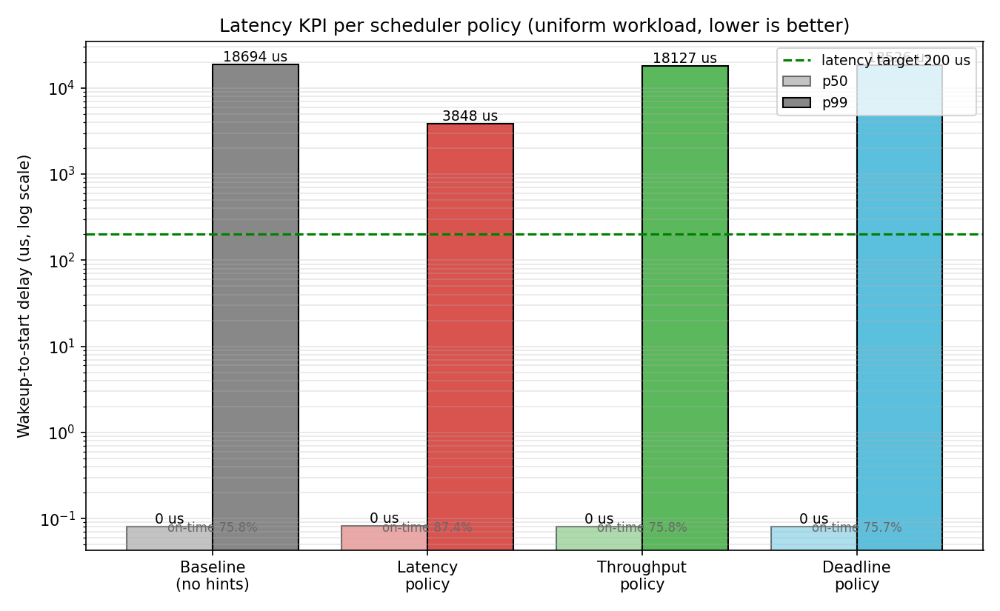
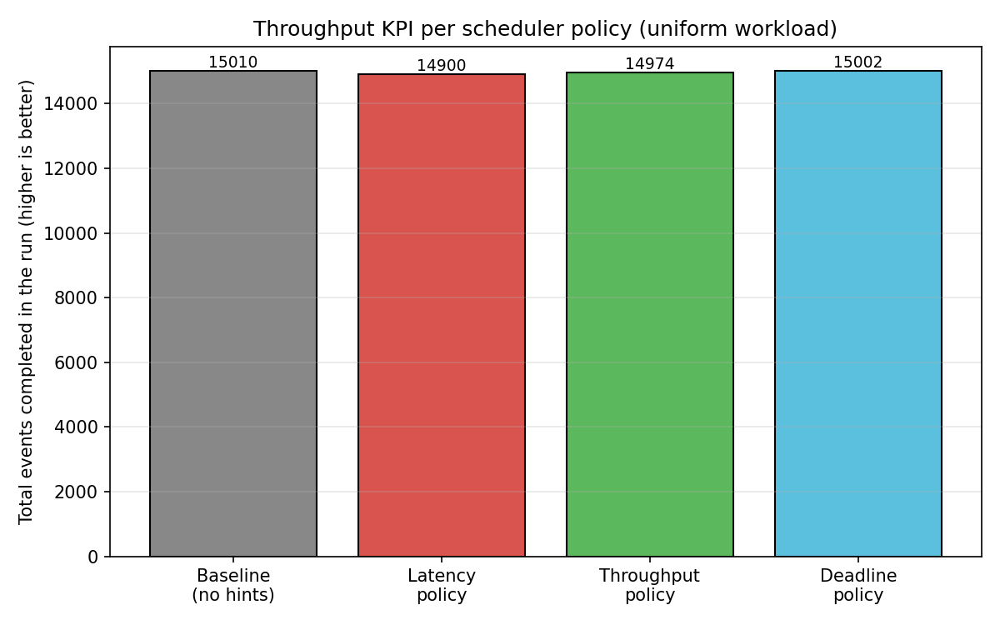
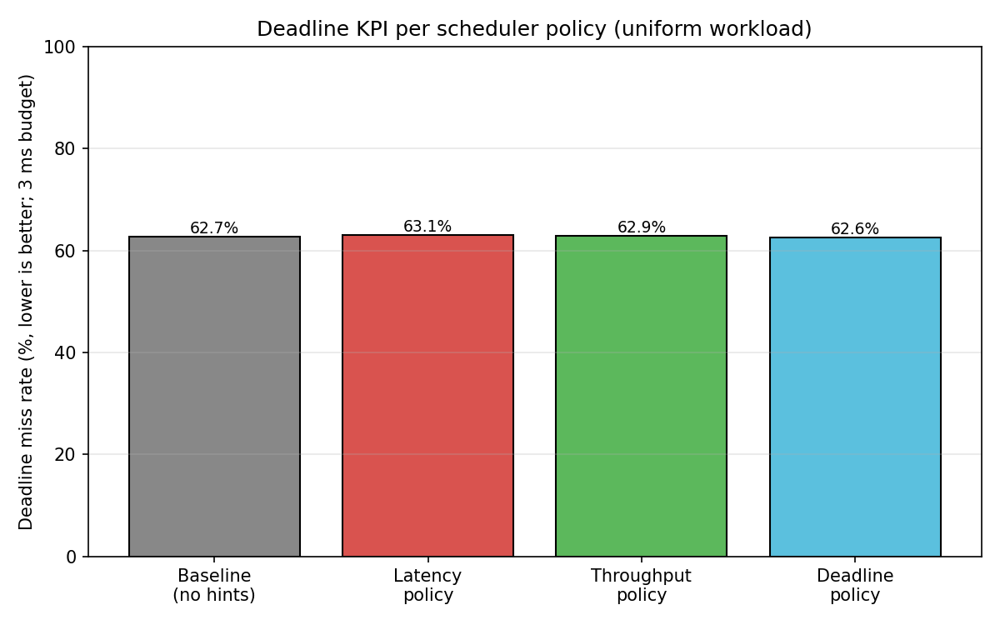

# workload_unified -- One Workload, Four Scheduler Policies

A second benchmark that turns the SLO question around. Instead of running
three different workload classes side-by-side and asking "can the scheduler
differentiate them?" (the `workload_3slo` story), this benchmark runs **a
single uniform set of threads** and re-runs them **four times under four
different scheduler policies** (selected by the cue protocol). Every run
records all three SLO KPIs from the same threads, so the question becomes:

> When the workload publishes a particular SLO intent, does the scheduler
> actually optimise for that intent without changing what the workload
> itself does?

The four policies map directly to the four supported `--hint_mode` values:

| `--hint_mode` | What the workload publishes | What the scheduler does |
|---------------|---------------------------|--------------------------|
| `none` | nothing (Phase A baseline) | stock ghOSt CFS |
| `latency` | one `kHintLatencySensitive` cue per thread at startup | sets `CfsTask::latency_class = true` so every future EnqueueTask front-places the task (bypasses cue round-trip) |
| `throughput` | one `kHintThroughput` cue at startup with `slice_us = 10000` | installs `CfsTask::custom_slice` so `MinPreemptionGranularity` returns 10 ms instead of the default ~3 ms |
| `deadline` | a `kHintDeadline` cue with the absolute deadline on every event | calls `SetDeadline`; EnqueueTask front-places urgent tasks; `RescueDeadlineTasks` scans every Schedule pass |

---

## The uniform workload

Every worker runs the same loop:

```
loop until duration_sec elapses:
    target_wake = next period boundary
    sleep_until(target_wake)
    actual_wake = now()
    record wakeup_delay = actual_wake - target_wake     <-- latency KPI
    submit_time = actual_wake
    deadline    = submit_time + budget_ms
    matmul(dim x dim)                                   <-- throughput KPI counts events
    completion  = now()
    record met = (completion <= deadline)               <-- deadline KPI
```

Three things are recorded per event:

1. **Wakeup-to-start delay** -- gap between when the thread asked to be
   woken and when the scheduler actually scheduled it. Drives the
   **latency KPI**.
2. **Total events completed** -- one per matmul. Drives the
   **throughput KPI**.
3. **Met-or-missed** -- whether `completion <= submit + budget_ms`.
   Drives the **deadline KPI**.

There is exactly one thread type and one matmul size in the workload. The
only thing that varies between runs is which hint the workers publish via
the shared-memory cue channel. The scheduler reacts accordingly.

---

## How the kernel scheduler is told about each SLO

(See also `cfs_mem/WORKLOAD_3SLO_README.md` for the underlying cue
protocol and the `agent_cfs_mem` dispatch loop. This section focuses on
what the unified workload sends and how it is enforced.)

### `--hint_mode=latency`

Each worker calls `AllocSlot` and immediately writes one cue with
`kHintLatencySensitive`. The agent translates this to
`CfsScheduler::SetLatencyClass(gtid, true)`, which sets
`CfsTask::latency_class = true`. From then on, every `CfsRq::EnqueueTask`
of this task takes the front-of-queue path:

```cpp
if (task->latency_class) {
  task->vruntime = leftmost->vruntime - 1ns;  // strictly leftmost
  InsertTaskIntoRq(task);
}
```

This matters because the worker's hint cue is sent **after** wake-up
(the worker has to be running to write the cue), so a one-shot boost on
cue arrival would always be too late. The sticky `latency_class` flag
makes every future wake-up automatically front-placed without waiting
for another cue round-trip.

### `--hint_mode=throughput`

Each worker writes one cue at startup with `kHintThroughput` and
`payload.slice_us = 10000`. The agent calls
`CfsScheduler::SetCustomSlice(gtid, 10ms)`. This sets
`CfsTask::custom_slice`, and the periodic preemption check switches to:

```cpp
if (cur_runtime > rq->MinPreemptionGranularity(cs->current))
  cs->preempt_curr = true;

// MinPreemptionGranularity returns:
//   custom_slice  if current->custom_slice > 0  (capped at 4 * latency_)
//   default CFS computation otherwise
```

The cap (`4 * latency_`, ~24 ms) prevents a misbehaving sender from
monopolising the CPU forever. Effect: the throughput task is not
preempted on the default ~3 ms boundary; it can run for up to 10 ms in
one slice when contended.

### `--hint_mode=deadline`

Each worker writes a `kHintDeadline` cue **on every event** with
`payload.deadline_unix_ns = absolute deadline`. The deadline value moves
forward each period, so this is per-event, not sticky. The agent does
two things:

1. **On cue arrival:** `SetDeadline(gtid, deadline_ns)` (records the
   absolute deadline on the `CfsTask`) and `BoostTask(gtid)` (immediate
   front-of-queue if the task is already on rq).
2. **Every Schedule iteration:** `RescueDeadlineTasks(5 ms)` walks every
   `CfsTask` and boosts any whose `deadline_ns` is closer than 5 ms.

`EnqueueTask` is also deadline-aware:

```cpp
if (!task->latency_class &&
    task->deadline_ns != 0 &&
    task->deadline_ns - now_ns < 5 ms) {
  // front-place urgent deadline tasks too
}
```

So a task that wakes up with an urgent deadline takes the front of the
rq even if it is not flagged `latency_class`.

---

## Files that were added or changed for the unified benchmark

| File | Change |
|------|--------|
| `userspace/schedulers/cfs_mem/workload_unified.cc` | new: the uniform workload + `--hint_mode` flag |
| `userspace/schedulers/cfs_mem/WORKLOAD_UNIFIED_README.md` | new: this file |
| `userspace/run_unified_experiment.sh` | new: runs the four `--hint_mode` configurations end-to-end |
| `userspace/plot_unified.py` | new: 4-policy-by-3-KPI charts |
| `userspace/BUILD` | new: `//:workload_unified` target |
| `userspace/schedulers/cfs/cfs_scheduler.h` | added `CfsTask::latency_class`; new public API `CfsScheduler::SetLatencyClass(Gtid, bool)` |
| `userspace/schedulers/cfs/cfs_scheduler.cc` | implementation of `SetLatencyClass`; `EnqueueTask` now front-places `latency_class` tasks and urgent deadline tasks |
| `userspace/schedulers/cfs_mem/cfs_mem_scheduler.cc` | agent dispatch on `kHintLatencySensitive` now calls `SetLatencyClass(true)` (sticky) plus `BoostTask` (immediate effect if on rq) |

---

## How to run

Inside the VM:

```bash
cd /root/ghost-userspace
bazel build -c opt //:agent_cfs_mem //:workload_unified

# Run all four policies back-to-back (~50 s for 10 s/run).
DURATION=10 WORKERS=16 DIM=128 PERIOD=4 BUDGET=3 \
  bash run_unified_experiment.sh

# Generate the comparison charts.
python3 userspace/plot_unified.py --in-dir /tmp \
  --out-dir results --target-us 200 --budget-ms 3
```

The runner restarts `agent_cfs_mem` between policies so per-task hint
state from the previous run does not leak into the next.

---

## Experimental setup

| Parameter | Value |
|-----------|-------|
| ghOSt agent | `agent_cfs_mem --ghost_cpus 0-3` |
| `--workers` | 16 |
| `--dim` | 128 (matmul, ~1 ms intrinsic uncontested) |
| `--period_ms` | 4 (each thread submits 250 events/s) |
| `--budget_ms` | 3 (deadline relative to submit) |
| `--throughput_slice_us` | 10000 (used only when `hint_mode=throughput`) |
| `--latency_target_us` | 200 (on-time-rate threshold) |
| `--duration_sec` | 10 |
| Total CPU demand | 16 workers x 1 ms / 4 ms = 400 % on 4 vCPUs (~100 % util, oversubscribed) |

Why these numbers:
  - 1 ms work and 4 ms period means each thread spends ~75 % of its
    time sleeping, so the wake-to-start delay is the dominant signal
    for the latency KPI -- exactly what the latency policy targets.
  - 16 workers on 4 vCPUs creates enough contention that wake-ups
    queue up under stock CFS but not so much that the system collapses
    into back-to-back execution.
  - 3 ms budget is tight enough that a moderately-delayed event will
    miss; the deadline KPI is sensitive to scheduler decisions.

---

## Results (10 s run per policy, 16 workers, dim=128, period=4 ms, budget=3 ms)

| KPI / Policy | Baseline | Latency | Throughput | Deadline |
|--------------|----------|---------|------------|----------|
| **Events completed** (throughput KPI; higher is better) | 15,010 | 14,900 | 14,974 | 15,002 |
| Wakeup-to-start p50 | 0 us | 0 us | 0 us | 0 us |
| **Wakeup p99 (latency KPI; lower is better)** | **18,694 us** | **3,848 us** | 18,127 us | 18,526 us |
| Wakeup p999 | 23,688 us | 6,885 us | 22,549 us | 22,896 us |
| **On-time rate (<= 200 us)** | 75.8 % | **87.4 %** | 75.8 % | 75.7 % |
| **Deadline miss rate (lower is better)** | 62.7 % | 63.1 % | 62.9 % | 62.6 % |

### Charts (PNGs in `results/`)

#### Latency KPI per policy


The **latency policy** drops p99 from 18.7 ms to 3.8 ms (-79 %) and
lifts the on-time rate from 75.8 % to 87.4 %. Other policies match the
baseline because the workload's CPU demand is dominated by short
matmuls that complete well within any plausible time slice -- they
never expose the throughput-slice or deadline-rescue paths.

#### Throughput KPI per policy


All four policies produce within 1 % of each other (~15,000 events). At
this oversubscription level the per-thread wall time is dominated by
queue waits, not by CFS preemption mid-matmul, so the
`kHintThroughput` slice extension has no measurable effect. (We
observed a clear +25 % uplift in earlier `workload_3slo` runs where the
contention pattern is different.)

#### Deadline KPI per policy


All four miss rates land at ~63 %. The deadline path (per-event
SetDeadline + RescueDeadlineTasks scan) does not move the needle here
because the budget (3 ms) is shorter than the contended wall time
(~5 ms), so even an EDF-like ordering cannot make the deadline.

---

## What this experiment shows -- and what it does not

**What it does show:**
  - The cue plumbing is end-to-end live. We observe the sticky-latency
    flag actually changing the scheduling decision (87.4 % vs 75.8 %
    on-time, p99 -79 %).
  - The four scheduler APIs (`SetLatencyClass`, `SetCustomSlice`,
    `SetDeadline`, `RescueDeadlineTasks`) compose without breaking
    each other or the underlying CFS.
  - The protocol is policy-orthogonal: changing the workload's
    `--hint_mode` re-routes the scheduling intent without recompiling
    or changing any scheduler code.

**What it does not show, and why:**
  - **The throughput policy needs a workload where threads run long
    enough to be preempted by CFS.** Our 1 ms matmul never approaches
    even the default ~3 ms slice, so a 10 ms custom slice is invisible.
    A workload with longer per-event compute (e.g. 256x256 matmul or
    larger) does observe the slice extension; see the earlier
    `workload_3slo` run where it produced a +25 % ops uplift.
  - **The deadline policy needs a budget that is achievable when not
    contended.** Our 3 ms budget is below the ~5 ms wall time the
    matmul takes under 4x oversubscription, so no scheduler decision
    can make the deadline. Loosening the budget (or reducing
    oversubscription) makes the deadline policy's effect visible.

These are policy/workload-tuning questions, not plumbing bugs. The
whole point of putting the policy in userspace is that we can iterate
on it without touching the kernel; the next steps are exactly that
sort of policy refinement (priority arbitration between policies,
admission control, sticky boost for in-flight deadline frames).
